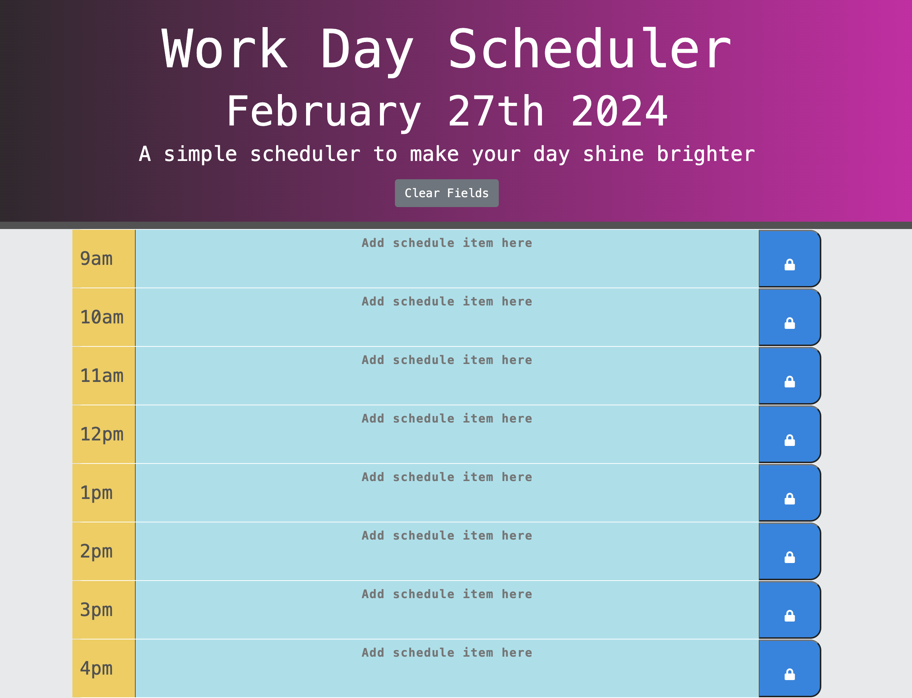
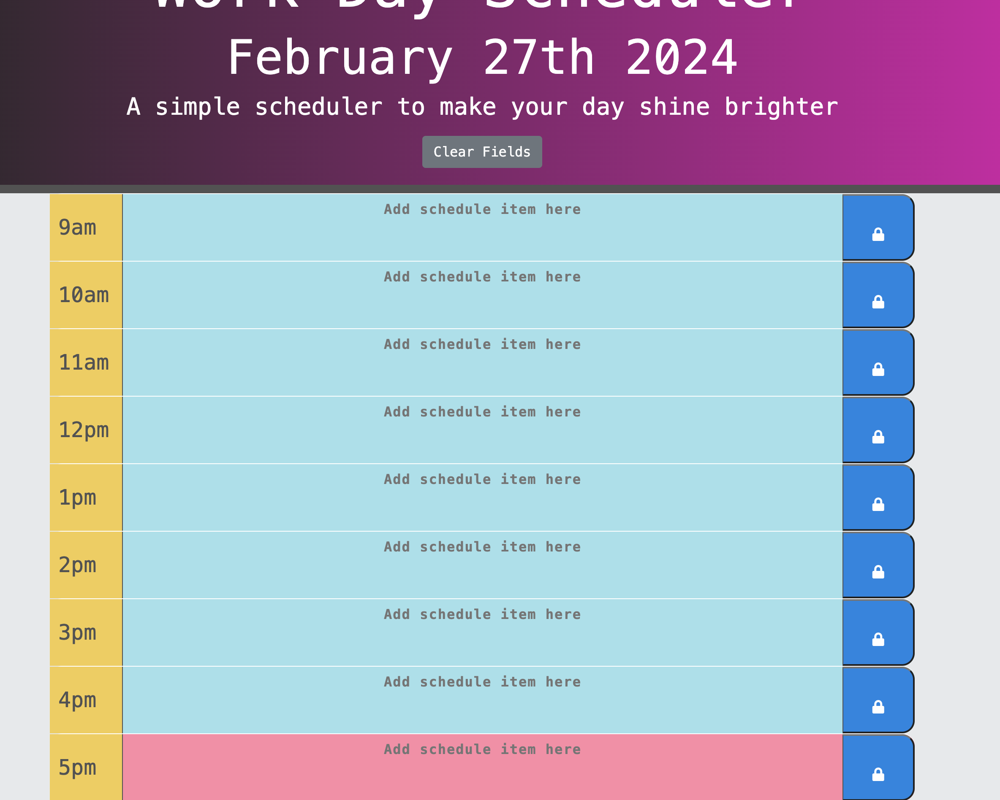

# Work-Day-Scheduler-Web-APIs

## Description & Goal

A simple, in browser, calendar application that allows a user to save events for each hour of a standard working day ( 9am - 5pm )

The app will utilize updated HTML and CSS that is powered by jQuery.

The following is a Mock Up demo application of functionality:

## Result

Here are images to show the resulting Work Day Scheduler followed by deployed website and repository.

Deployed Website: 

Repository Website: 

## Usage

All materials should be present within repository. 

## Credits

All contributions are from me, github.com/songbirdcode.

All can be adjusted as required as I continue to learn and grow. As we face more group projects, I will add more here. 

I used sources from reading developer.mozilla.org, https://jqueryui.com/, w3schools.com, along with materials presented within our bootcamp revolving around Web based APIs.

## License

MIT License © 2023 Songbirdcode
---

## Badges

No Badges for this project. 

## Features

HTML, CSS, JQuery, Bootstrap all utilized within UI

## Tests
